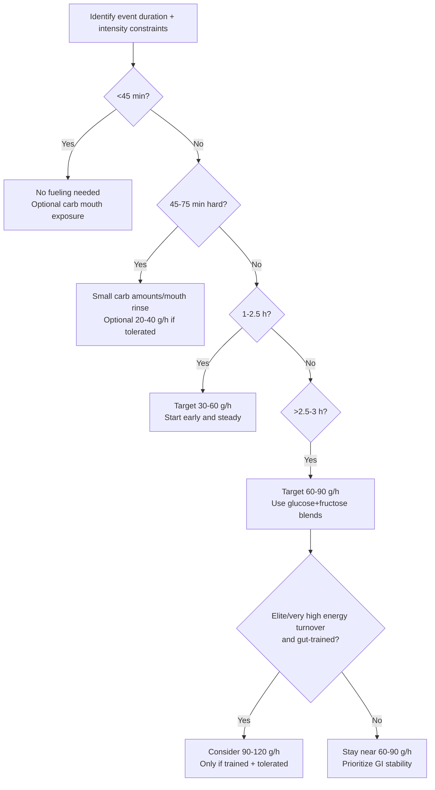

# Foundations and Latest Findings in Nutrition for Cycling

## Executive summary

Cycling performance is constrained by a predictable set of bottlenecks that change by event type: rapid glycogen use at high power outputs, limited gut absorption of carbohydrate during exercise, accumulating dehydration and electrolyte losses (especially in heat), neuromuscular fatigue and muscle damage over rough terrain and repeated days, and—particularly in weight-sensitive cycling cultures—the health and performance costs of low energy availability. citeturn24view2turn18view0turn15view1

Across disciplines from criterium racing to ultra-endurance, the most consistently supported “big rocks” are: (1) meet total energy demand and avoid prolonged under-fueling, (2) match carbohydrate availability to session/race demands (“fuel for the work required”), (3) dose carbohydrate during racing based on duration and intensity while training the gut to tolerate it, (4) distribute sufficient protein across the day, emphasizing a post-exercise bolus, and (5) individualize hydration and sodium using sweat-rate data and hyponatremia risk management. citeturn18view0turn18view1turn18view2turn18view3turn15view1turn41view0

The baseline endurance-race guideline for carbohydrate intake during exercise remains 30–60 g/h for ~1–2.5 h and up to ~90 g/h for events beyond ~2.5–3 h (preferably via multiple-transportable carbohydrates such as glucose+fructose). citeturn18view1turn33view2  
Recent laboratory work in trained cyclists shows that 120 g/h (typically using ~1:0.8 glucose(or maltodextrin):fructose) can be practically tolerable and yields higher exogenous carbohydrate oxidation than 90 g/h in some conditions; however, clear race-performance proof in cycling at 100–120 g/h is still incomplete and context-dependent (race duration, intensity, athlete level, and GI tolerance). citeturn21view3turn38view0turn39view0turn33view2

Carbohydrate periodization (“train low,” “sleep low,” etc.) has a mechanistic basis (signaling and metabolic adaptation), but the highest-quality synthesis in endurance-trained athletes finds no overall endurance performance improvement versus consistently high carbohydrate availability, and a dedicated five-week cyclist intervention similarly found no superiority versus a high-carbohydrate diet. citeturn41view0turn40view1

For protein, consensus-style guidance converges on ~1.2–2.0 g/kg/day for most athletes, with practical emphasis on a post-exercise dose around 0.25–0.3 g/kg (often ~15–25 g) and repeated protein-containing meals every ~3–5 hours; leucine content matters, with target leucine per dose commonly in the ~0.7–3.0 g range (or leucine-rich whole proteins). citeturn18view2turn25view1  
In masters athletes, per-meal protein needs can trend higher (often discussed around ~0.3–0.4 g/kg per meal, and up to ~0.5 g/kg after endurance exercise in some frameworks) to overcome age-related anabolic resistance—especially when energy availability is marginal. citeturn25view0turn18view2

Hydration strategy is best individualized: pre-exercise 5–10 mL/kg in the 2–4 h before, typical during-exercise drinking often lands around ~0.4–0.8 L/h, and post-exercise rehydration often requires ~125–150% of the measured fluid deficit plus sodium to retain fluid—while actively avoiding overdrinking and exercise-associated hyponatremia. citeturn18view3turn18view4turn21view1

Ergogenic aids with the strongest, most replicable utility in cycling under appropriate scenarios include caffeine (generally 3–6 mg/kg) and, depending on race demands, sodium bicarbonate for high-intensity efforts (often ~0.3 g/kg, timed to individual tolerance). Nitrate (beetroot) can yield small benefits in some time-trial-like durations and certain athlete subgroups; creatine and beta-alanine can be relevant for sprint/anaerobic repeatability but come with tradeoffs (e.g., mass gain for creatine, paresthesia for beta-alanine). Supplement use must also be framed by contamination and anti-doping risk control (third-party testing, risk-benefit analysis). citeturn24view0turn23view0turn32search19turn5search12turn5search1turn17view2turn17view3

## Physiological demands by event type and what they imply for nutrition

A practical way to think about cycling nutrition is: event demands determine which limiter you must protect first—glycogen and blood glucose at high intensity, fluid and sodium under heat stress, muscle damage and “durability” under long/rough riding, and total energy availability across multi-day and ultra formats. citeturn24view2turn18view1turn18view3turn31search7

### Comparative demand profile by event type

| Event type | Typical intensity pattern | Primary physiological limiters | Nutrition “must-haves” (priority order) |
|---|---|---|---|
| Criterium (crit) | Highly stochastic, repeated surges and accelerations, frequent high power spikes | Rapid glycogen draw, high glycolytic flux, neuromuscular fatigue, heat stress in summer crits | Carbohydrate availability (pre + during if >45–60 min), caffeine if tolerated, hydration plan if hot; avoid GI distress from overfeeding | citeturn31search0turn18view1turn24view0turn18view3 |
| Road race | Variable: endurance base with repeated climbs/attacks/sprints; often 3–6 h | Glycogen depletion, falling blood glucose, dehydration/sodium losses, GI tolerance | Early and steady carbohydrate dosing (often 60–90 g/h for longer races), multiple-transportable carbs, fluids + sodium individualized | citeturn18view1turn33view2turn18view4 |
| Time trial (TT) | Sustained high fraction of threshold/VO₂ domain; typically 10–60+ min | High carbohydrate oxidation rate, pacing/durability, central fatigue | High-carb pre, optional in-event carbs for longer TTs, caffeine; nitrates sometimes (small effects, variable) | citeturn18view1turn24view0turn32search19 |
| Stage race | Repeated days of high energy turnover + repeated high-intensity bouts | Failure to restore glycogen and fluids between stages; cumulative muscle damage; under-eating risk | Maximize day-to-day carbohydrate and energy intake, “speedy refuelling” immediately post-stage, protein distribution, aggressive recovery hydration | citeturn18view0turn18view5turn24view2 |
| Gravel | Long duration + intermittent intensity + technical segments; often limited feeding opportunities | Carbohydrate + hydration logistics, GI tolerance under jostling, muscle damage, dehydration | Portable carb plan (mix liquids + gels/chews/solids), sodium/hydration planning, simplify fiber/fat during race, pre-plan access points | citeturn31search2turn31search30turn18view1turn32search2 |
| Ultra-endurance cycling | Very long duration, metabolic “ceiling,” sleep disruption, appetite suppression | Total energy deficit (can be massive), GI tolerance, dehydration/hyponatremia risk, mood/cognition | Prioritize tolerable calories + carbs, diversify textures, manage sodium/fluids by data + thirst, caffeine strategy for alertness, protect energy availability | citeturn31search7turn21view1turn32search2turn15view1 |

Gravel and newer cycling disciplines have substantially less peer-reviewed, cycling-specific nutrition evidence than road cycling; current best practice is therefore to apply established endurance principles while acknowledging logistical constraints and higher GI symptom prevalence risk in real-world conditions. citeturn31search2turn32search2turn24view2

## Carbohydrate strategy, timing, and periodization

Carbohydrate is the dominant performance macronutrient in cycling because high power outputs require high carbohydrate oxidation, glycogen stores are finite, and exogenous carbohydrate intake can support blood glucose and carbohydrate oxidation as endogenous stores fall. citeturn18view4turn33view2turn24view2

### Core carbohydrate targets across training and racing

The joint sports nutrition position paper used widely in practice provides a clear baseline framework for cycling: daily carbohydrate scaled to training load, carbohydrate loading for >90-min events, pre-event fueling, and during-event intake scaled to duration. citeturn18view0turn18view1

| Scenario | Target | Timing focus | Notes for cyclists |
|---|---:|---|---|
| Daily carbohydrate (light training) | ~3–5 g/kg/day | Across day | Often sufficient for low-intensity/off days; supports energy without unnecessary surplus | citeturn18view0 |
| Daily carbohydrate (moderate training, ~1 h/day) | ~5–7 g/kg/day | Across day | Typical for base riding and moderate intensity blocks | citeturn18view0 |
| Daily carbohydrate (high training, 1–3 h/day mod-high) | ~6–10 g/kg/day | More around key sessions | Helps maintain glycogen and training quality | citeturn18view0turn24view2 |
| Daily carbohydrate (very high, >4–5 h/day mod-high) | ~8–12 g/kg/day | High frequency intake | Most relevant to heavy stage-race prep and high-volume camps | citeturn18view0 |
| Carbohydrate loading (>90 min event) | ~10–12 g/kg/day for ~36–48 h | Day(s) pre-event | Choose low-fiber/residue options if gut comfort is an issue | citeturn18view0turn18view1 |
| Pre-event meal (exercise >60 min) | ~1–4 g/kg | ~1–4 h pre | Lower fat/fiber helps reduce GI risk; liquid carbs can help if nervousness suppresses appetite | citeturn18view1turn18view4 |
| During endurance exercise (1–2.5 h) | ~30–60 g/h | Start early, steady dosing | Mix drink + gels/chews; avoid “catch-up” boluses late | citeturn18view1turn33view2 |
| During ultra-endurance (>2.5–3 h) | Up to ~90 g/h | Sustained dosing | Prefer multiple-transportable carbs (glucose+fructose) to raise oxidation and reduce GI issues | citeturn18view1turn33view2 |
| Rapid refueling (<8 h between hard sessions) | ~1.0–1.2 g/kg/h for ~4 h | Immediately post | Priority for stage races and double-days | citeturn18view0turn18view5turn33view2 |

### “Latest finding” on very high carbohydrate intakes (100–120 g/h)

Modern carbohydrate physiology work emphasizes intestinal transport limitations: glucose transport (SGLT1) tends to saturate near the ingestion rates that yield ~1.0–1.1 g/min exogenous oxidation, while adding fructose (GLUT5) increases total absorption and oxidation—supporting the long-standing practical recommendation to use glucose+fructose blends at higher intakes. citeturn33view2

Two cycling-relevant findings matter for practice:

1) **120 g/h can be tolerated in trained athletes under controlled conditions, and delivery form can be flexible.** A controlled cycling study using 120 g/h found comparable exogenous oxidation across drink, gel, and chew formats with minimal GI symptoms reported, suggesting athletes can choose forms that match handling and preference. citeturn38view0turn39view0  

2) **120 g/h can increase exogenous carbohydrate oxidation vs 90 g/h, but performance implications are not fully settled.** In trained cyclists, 120 g/h (0.8:1 fructose:maltodextrin) produced higher exogenous oxidation than 90 g/h, without additional sparing of endogenous carbohydrate in that design; the authors explicitly call for further performance tests. citeturn21view3  

A conservative, evidence-aligned translation is: **90 g/h remains a strong default ceiling for most athletes and events, but 100–120 g/h may be reasonable for select riders in long, high-carb-demand races (e.g., hard stage racing, long gravel, some ultras) if and only if it is trained, tolerated, and logistically feasible.** citeturn18view1turn33view2turn38view0turn21view3

### Carbohydrate periodization: what the evidence says

“Train low” strategies are often justified via molecular signaling and metabolic adaptation, but performance is the endpoint that matters. In endurance-trained athletes, a systematic review/meta-analysis found **no overall endurance performance benefit** of periodized carbohydrate restriction compared with normal high carbohydrate availability training. citeturn41view0  
In well-trained cyclists, a five-week controlled intervention similarly reported **no superiority** of a periodized carbohydrate approach versus a high-carbohydrate diet for MLSS-related outcomes and substrate oxidation. citeturn40view1

For cycling practice, the most defensible use of periodization is therefore not “because it wins races,” but because it can be a **tool** to:  
- manage energy intake on true low-intensity days,  
- reduce unnecessary carbohydrate when training quality doesn’t depend on it, and  
- avoid chronic carbohydrate restriction that degrades interval quality and increases under-fueling risk. citeturn41view0turn40view1turn24view2turn15view1

### Decision logic for race-day carbohydrate (mermaid)

This logic reflects baseline duration-based fueling guidance and the evidence that very high carbohydrate intakes can be tolerable and may raise exogenous oxidation in trained cyclists, while remaining cautious about incomplete performance evidence. citeturn18view1turn33view2turn21view3turn38view0

## Protein needs, fat strategies, and body composition management

### Protein: daily targets, timing, and leucine thresholds

Protein supports muscle repair/remodeling, connective tissue turnover, and adaptation. The applied consensus range commonly cited for athletes is ~1.2–2.0 g/kg/day; practical emphasis is on distributing protein across the day and using a post-exercise bolus. citeturn18view2turn25view1

Key applied targets from consensus-style sources:

- **Daily protein:** commonly ~1.2–2.0 g/kg/day for most athletes; higher intakes may be useful during heavy training, energy deficit, or injury/immobility periods. citeturn18view2turn25view1  
- **Post-exercise dose:** ~0.25–0.3 g/kg (often ~15–25 g for many athletes), ideally within ~0–2 hours post session, and repeated protein-containing meals every ~3–5 hours. citeturn18view2turn25view1  
- **Leucine “trigger”:** per-serving leucine in the ~0.7–3.0 g range is commonly cited in ISSN-style guidance; leucine-rich proteins (e.g., dairy/whey or mixed high-quality proteins) help meet this. citeturn25view1turn18view2  

For masters athletes, anabolic resistance can increase the per-meal requirement; one review discusses ~0.4 g/kg per meal in older untrained contexts and emphasizes that older athletes may need higher per-meal targets to maximize myofibrillar protein synthesis. citeturn25view0

### Protein targets table for cyclists

| Use case | Daily protein | Per-meal target | Timing notes |
|---|---:|---:|---|
| Most competitive adult cyclists | ~1.2–2.0 g/kg/day | ~0.25–0.3 g/kg (often ~20–40 g) | Distribute every ~3–5 h; include a post-ride bolus | citeturn18view2turn25view1 |
| Stage races / heavy blocks | Upper end of range often needed | Maintain per-meal target + consistent snacks | Protein supports remodeling while carbs restore glycogen; prioritize total energy | citeturn18view2turn18view5turn24view2 |
| Weight loss phase (performance protected) | Often toward upper end | Maintain leucine-rich servings | Higher protein can protect lean mass under energy deficit | citeturn25view1turn15view1 |
| Masters athletes | Often ≥ ~1.6 g/kg/day is commonly discussed | ~0.3–0.4 g/kg per meal (sometimes higher post-exercise) | Focus on dose and distribution; late-day protein can help total distribution | citeturn25view0turn25view1 |

### Fat adaptation vs high-carbohydrate strategies

Approaches range from consistently high carbohydrate availability to low-carbohydrate high-fat (LCHF) and ketogenic diets. The core tradeoff is:

- LCHF/ketogenic diets reliably increase fat oxidation, but **often do not improve performance and can impair high-intensity capacity** that is central to most competitive cycling formats. citeturn24view1turn41view0turn20search0  
- A formal position stand on ketogenic diets concludes effects on athletic performance are largely neutral or detrimental compared with higher carbohydrate diets, and that studies in elite athletes generally show decrements (particularly in shorter interventions). citeturn24view1  
- In elite racewalkers, a controlled comparison reported diminished training quality with a ketogenic LCHF approach versus higher carbohydrate comparators—an important proxy lesson for cycling, where training quality (interval power) is pivotal. citeturn20search0  
- Systematic review-level evidence generally does not support ketogenic diets as performance-enhancing for aerobic endurance, even if they might be used for other goals (e.g., appetite control) with careful management. citeturn20search27turn24view1  

A defensible cycling-specific synthesis is:

- **High-carb is the performance baseline** for criteriums, road races with surges, time trials, and most stage racing due to the carbohydrate cost of high power outputs. citeturn18view1turn24view2turn33view2  
- **“Train low” is not “race low.”** Periodization may be used to manage energy or target certain low-intensity training contexts, but chronic restriction is not supported as a performance enhancer in endurance-trained athletes. citeturn41view0turn40view1turn24view2  
- **Ketogenic/LCHF can be considered a niche choice** primarily for non-performance reasons, with explicit acknowledgement of likely high-intensity tradeoffs and the risk of underfueling in cycling cultures. citeturn24view1turn15view1turn20search0  

### Weight management and body composition: performance-first constraints

Cycling rewards power-to-weight, so cyclists face substantial pressure to reduce body mass. The current International Olympic Committee consensus on REDs emphasizes that attempts to improve power-to-weight ratios and achieve excessive leanness are common pathways into problematic low energy availability, which can harm health and performance. citeturn15view1turn14view4

Key points with direct cycling relevance:

- A universal “30 kcal/kg fat-free mass/day” low energy availability threshold is debated; the consensus notes uncertainty and individual variability, and that male thresholds are even less understood. citeturn15view1turn14view0  
- In competitive male road cyclists, low energy availability screening linked low EA with adverse bone/endocrine outcomes and performance consequences, underscoring that underfueling is not only a female issue. citeturn29search14  
- Menstrual disruption data also challenge a single fixed threshold model; risk can increase as energy availability decreases even without a sharp cutoff. citeturn29search7turn15view1  

Practically, **weight manipulation is safest and most performance-preserving when it is slow, paired with adequate protein, and timed away from the highest-intensity training blocks and key races.** This is not a moral preference; it is an energy availability and training quality constraint. citeturn15view1turn18view2turn41view0

## Hydration and electrolyte strategies with sweat-rate guidance

Hydration in cycling is a performance and safety issue: too little fluid increases cardiovascular and thermal strain; too much fluid (especially low-sodium fluid) increases hyponatremia risk. citeturn18view3turn18view4turn21view1

### Baseline hydration guidance (evidence-based practical ranges)

From applied consensus guidance:

- **Pre-exercise:** ~5–10 mL/kg in the 2–4 hours before exercise to start euhydrated (practical monitoring: pale urine), with sodium in pre-exercise foods/fluids helping retention. citeturn18view3turn18view4  
- **During exercise:** sweat rates vary widely (reported ~0.3–2.4 L/h), and typical intake that “fits most” often lands around ~0.4–0.8 L/h, but must be individualized by tolerance, opportunities to drink, and environmental conditions. citeturn18view3turn18view4  
- **Post-exercise:** effective rehydration often requires ~125–150% of the measured fluid deficit (e.g., 1.25–1.5 L per kg body mass lost) plus sodium to retain fluid. citeturn18view4  

### Sweat-rate field method (cycling-usable)

The position paper describes a practical approach: measure pre- and post-exercise body mass and account for drinking/urination; approximately **1 kg body mass loss ≈ 1 L sweat loss** in most typical scenarios (recognizing some caveats for very prolonged events with substantial substrate mass loss). citeturn18view3

A usable equation:

- **Sweat rate (L/h)** ≈ (Pre BM − Post BM + Fluid in − Urine out) / Hours

Then build a plan that generally avoids large deficits and also avoids overdrinking. citeturn18view3turn21view1

### Sodium and electrolyte replacement

Key applied points:

- Sodium is recommended during exercise when sweat sodium losses are large (e.g., high sweat rate > ~1.2 L/h, “salty sweaters,” or prolonged exercise > ~2 h). citeturn18view4  
- Sweat sodium concentration is highly variable, but the position paper cites an average around ~50 mmol/L (~1 g/L). citeturn18view4  
- A recent review on sodium intake emphasizes that pre-exercise sodium can improve fluid retention, and that higher sodium concentrations than typical sports drinks may be needed to maximize retention in some settings—highlighting that sodium strategy is context-specific (heat, access to fluids, sweat losses, GI tolerance). citeturn21view2turn18view4  

### Hyponatremia risk management

Overdrinking is the primary driver of exercise-associated hyponatremia (EAH), and strategies that align intake with thirst can substantially reduce incidence without harming performance completion in endurance contexts. citeturn21view1turn18view4  
Cyclists should treat the combination of *aggressive drinking + low sodium intake + long duration* as a red-flag scenario. citeturn18view4turn21view1

### Hydration/electrolyte guideline table

| Phase | Fluid target | Sodium/electrolyte target | Implementation detail |
|---|---|---|---|
| Pre (2–4 h) | ~5–10 mL/kg | Add sodium if needed for retention | Use urine color as a coarse check; avoid last-minute overdrinking | citeturn18view3turn21view2 |
| During | Often ~0.4–0.8 L/h (individualize) | Sodium during long/hot/high-sweat events; sweat [Na⁺] highly variable | Use sweat-rate testing; include sodium especially if >2 h and/or heavy sweater | citeturn18view3turn18view4turn21view2 |
| Post | ~125–150% of deficit | Sodium supports retention | Rehydrate gradually; include salty foods/drinks | citeturn18view4 |
| Safety | Avoid overdrinking | Prevent EAH | “Drink to thirst” style guidance reduces EAH risk in endurance settings | citeturn21view1turn18view4 |

## Caffeine and common ergogenic aids

Supplement strategy in cycling should be framed as: (1) legality and contamination risk control, (2) clear performance mechanism aligned to event demands, (3) individualized tolerance (sleep/GI), and (4) practice in training. The IOC consensus highlights persistent contamination risk (including undeclared prohibited substances) and recommends risk-benefit analysis and risk-reduction measures such as third-party auditing programs—without implying any product is “guaranteed safe.” citeturn17view2turn17view3

### Evidence-based dosing and timing (cycling-relevant)

| Ergogenic aid | Best-supported use cases in cycling | Typical dosing | Timing | Main risks/limits |
|---|---|---:|---|---|
| Caffeine | Endurance performance, TT performance, alertness; also repeated sprint contexts | Commonly 3–6 mg/kg; minimal effective dose may be ~2 mg/kg | Often ~60 min pre; alternative forms (gum/gels) can shift timing | Sleep disruption, anxiety, GI upset; individual response varies | citeturn24view0turn17view0 |
| Dietary nitrate / beetroot | Some TT-like efforts (5–30 min), possible efficiency gains; variable effects | Often ~6–8 mmol (~350–500 mg nitrate) | ~2–3 h pre; sometimes multi-day loading | Response heterogeneity; effects can be small; oral microbiome factors matter | citeturn4search22turn32search19turn33view2 |
| Sodium bicarbonate | High-intensity cycling tasks (~30 s–12 min), repeated bouts | Single dose: minimum ~0.2 g/kg; often ~0.3 g/kg; multi-day protocols possible | ~60–180 min pre (individualize) | GI distress (bloating, nausea); trial dosing required | citeturn23view0turn17view0 |
| Beta-alanine | Buffering for high-intensity efforts (classically ~1–4 min domain), repeated hard efforts | Chronic: often ~4–6 g/day (divided doses) for weeks | Loading phase over weeks | Paresthesia; benefit is event-specific | citeturn5search1 |
| Creatine monohydrate | Repeated sprint ability, training adaptation support; may help sprint/leadout robustness | Loading often ~20 g/day for ~5–7 days then ~3–5 g/day | Not acute; daily | Water-related mass gain (often undesirable uphill); GI upset in some | citeturn5search12turn4search24turn17view0 |

Cycling-specific nuances:
- Combining caffeine + nitrates does not clearly outperform caffeine alone in time-trial outcomes in meta-analysis, suggesting limited value in stacking those two specifically unless an athlete has shown individual benefit. citeturn32search1  
- Nitrate supplementation shows small average effects in certain endurance time-trial windows, but variability is large and study contexts differ; it tends to be more plausible as a marginal gain than as a primary strategy. citeturn32search19turn4search22  
- Sodium bicarbonate is among the more evidence-supported options for high-intensity performance, but GI tolerance is the gating constraint and often determines whether it is net-positive in real racing. citeturn23view0turn32search2  

## Practical fueling protocols by event type, recovery nutrition, GI tolerance, and research gaps

### In-race fueling mechanics: gels, drinks, solids, and practical absorption constraints

For most cyclists, the limiting step is not “access to carbohydrate,” but **absorption and tolerance**. Modern reviews emphasize:
- Glucose-only oxidation tends to plateau around ~1.0–1.1 g/min with higher ingestion, consistent with intestinal transporter saturation. citeturn33view2  
- Adding fructose increases total absorption/oxidation and can reduce GI issues at higher total carbohydrate intakes; ratios closer to ~1:0.8 (glucose:maltodextrin : fructose) are argued to improve oxidation efficiency and comfort compared with older 2:1 ratios in some contexts. citeturn33view2turn39view0  
- At 120 g/h, trained cyclists can achieve very high exogenous oxidation with minimal symptoms, and delivery form can be flexible (drink vs gel vs chew), which supports mixed-format fueling in real races (especially gravel/ultra where palate fatigue and texture variety matter). citeturn38view0turn39view0  
- “Hydrogel” carbohydrate products do not currently show consistent advantages over standard carbohydrate products for GI outcomes or performance, so they should not be treated as a requirement. citeturn32search2turn33view2  

### GI tolerance strategies (what actually works)

A recent practical synthesis of GI-minimization strategies emphasizes three levers that matter most in endurance settings:
1) **Gut training** (rehearsing race-level carbohydrate and fluid intake in training) to improve tolerance and reduce symptoms over time. citeturn32search2turn32search8  
2) **Low-FODMAP short-term intervention** in athletes with recurrent symptoms (especially those with IBS-like patterns), while acknowledging restrictiveness tradeoffs. citeturn32search2turn32search3  
3) **Macronutrient simplification pre-race** (lower fat/fiber; avoid unfamiliar foods; use liquid carbs when appetite is low). citeturn18view4turn32search2  

### Recovery nutrition (glycogen resynthesis + repair)

When recovery time is short (stage races, double-days), carbohydrate timing becomes more important. Guidance supports:
- **Early carbohydrate intake** post-exercise to maximize glycogen resynthesis, with ~1.0–1.2 g/kg/h for the first ~4 hours when rapid refueling is needed. citeturn18view0turn18view5turn33view2  
- **Carbohydrate + protein** can be useful when carbohydrate intake is suboptimal; one cited comparison showed similar glycogen repletion and performance recovery between 1.2 g/kg carbohydrate versus 0.8 g/kg carbohydrate + 0.4 g/kg protein in some conditions. citeturn18view5  
- Protein should be included early post-exercise and spaced over the day to support remodeling. citeturn18view2turn25view1  

### Event-specific sample fueling protocols (with grams and timing)

Below are practical templates built from consensus carbohydrate/hydration guidance, updated carbohydrate absorption findings, and supplementation position stands. citeturn18view1turn18view3turn24view0turn23view0turn33view2turn38view0

Assumptions for worked examples: **70 kg rider** (adjust by body mass and sweat rate), moderate conditions unless noted.

| Event | Day-before / lead-in | Pre-start (1–4 h) | During race | Caffeine (optional) | Immediately post |
|---|---|---|---|---|---|
| Crit (45–75 min) | Normal high-carb day if racing hard; avoid heavy fiber late | 1–2 g/kg carbs 1–3 h before (70–140 g) | If ~45–75 min and very hard: optional small carbs (e.g., 20–40 g total) or mouth exposure; fluids as needed | 3–6 mg/kg ~60 min pre (210–420 mg) if tolerated | 1–1.2 g/kg carbs + 0.25–0.3 g/kg protein if another session soon | citeturn18view1turn24view0turn18view5 |
| TT (20–60 min) | Ensure glycogen (normal to high carb) | 1–4 g/kg (70–280 g) depending on start time and gut | Often not needed <45 min; for longer TTs, consider 30–60 g/h (mostly via drink) | 3–6 mg/kg ~60 min pre | Standard recovery; prioritize carbs if racing again soon | citeturn18view1turn24view0turn18view5 |
| Road race (3–6 h) | Carbohydrate focus 24–48 h; consider load for key races (10–12 g/kg/day for 36–48 h) | 1–4 g/kg 1–4 h pre; low fat/fiber | Target 60–90 g/h; use glucose+fructose blends; start in first 15–20 min; fluids ~0.4–0.8 L/h + sodium as needed | 3–6 mg/kg pre; consider smaller “top-ups” later if long race and sleep not impacted | If <8 h to next hard ride: 1–1.2 g/kg/h for ~4 h + protein bolus | citeturn18view0turn18view1turn18view3turn33view2turn24view0turn18view5 |
| Stage race (daily) | Maintain very high daily carbs (often 8–12 g/kg/day) + enough total energy | 1–4 g/kg | 60–90 g/h baseline; consider 90–120 g/h only if gut-trained and race demands justify; mixed formats; hydration and sodium tightly planned | Caffeine strategically (not every day at max dose if sleep suffers) | Aggressive recovery: carbs immediately; 1–1.2 g/kg/h for ~4 h if next day is demanding; protein distributed | citeturn18view0turn18view5turn38view0turn21view3turn24view0 |
| Gravel (4–10+ h) | Carbohydrate load for A races; plan logistics (aid/feeds) | 1–4 g/kg; keep fiber/fat low | 60–90 g/h baseline; prioritize liquids early; add gels/chews/low-fat solids; sodium plan important; consider texture variety to prevent appetite fatigue | Caffeine as needed; avoid GI stacking late | Rehydrate + sodium; carbs + protein; manage muscle damage with total energy and protein | citeturn18view1turn31search30turn32search2turn18view4turn24view0 |
| Ultra (10–24 h or multi-day) | Plan for metabolic ceiling and appetite decline; diversify foods | 1–4 g/kg if feasible | Focus on tolerable calories: often 40–90+ g/h carbs depending on tolerance; mix sweet + savory; manage sodium and fluids carefully; avoid overdrinking | Caffeine planned in blocks to preserve alertness | Keep eating after finish; rehydrate gradually; prioritize sleep + carbs + protein | citeturn31search7turn21view1turn32search2turn18view4turn24view0 |

### Sample “race bottle + gel” fueling math (70 kg examples)

These are not product endorsements; they illustrate dose math.

- **60 g/h plan:** e.g., 1 bottle with 30 g carbs + 1 gel with 30 g carbs each hour. citeturn18view1turn33view2  
- **90 g/h plan:** e.g., 1 bottle with 45 g + 1 gel with 45 g per hour, ideally with glucose+fructose blend to support oxidation and reduce GI risk. citeturn18view1turn33view2  
- **120 g/h plan (advanced):** evidence supports tolerability in trained cyclists using mixed formats and ~1:0.8 glucose(or maltodextrin):fructose; practically, this often requires concentrated bottles plus additional gels/chews and deliberate gut training. citeturn38view0turn21view3turn33view2  

### Female-specific and age-related considerations that change implementation

Female athletes:
- The REDs consensus highlights that low energy availability affects both sexes and that weight/physique pressures are a key pathway into harm; for female cyclists, chronic underfueling can present with endocrine and bone health consequences, and menstrual status is a relevant health signal (with ample individual variability). citeturn15view1turn29search7  
- The sports nutrition position paper notes women often have smaller body size and lower sweat rates and may be at higher risk of overdrinking and hyponatremia in some contexts, reinforcing the need for individualized fluid planning rather than blanket “drink as much as possible” habits. citeturn18view4turn21view1  

Age-related:
- Older athletes may experience decreased thirst sensation, so relying purely on thirst may under-serve some individuals; sweat-rate-based heuristics can help. citeturn18view4  
- Protein distribution becomes more important with age due to anabolic resistance; per-meal targets may need to be higher than in younger adults to maximize muscle protein synthesis. citeturn25view0turn25view1  

### Research gaps and priorities

Even with strong general sports nutrition evidence, cycling-specific gaps remain:

- **Performance outcomes for 100–120 g/h carbohydrate in real racing:** laboratory evidence supports tolerability and increased exogenous oxidation in trained cyclists, but definitive cycling race-performance RCTs across varied event types remain limited. citeturn21view3turn38view0turn33view2  
- **Gravel and emerging discipline specificity:** peer-reviewed evidence is explicitly limited; much practice is extrapolation from road endurance principles plus small observational studies. citeturn31search2turn31search30  
- **REDs and cycling cultures:** the consensus stresses complexity, individual variability, and the need for better methods for assessing energy availability in free-living athletes—critical in cycling given weight sensitivity. citeturn15view1turn18view0turn29search14  
- **Sex-specific guidance quality:** multiple bodies note limited sex-specific evidence for many recommendations, pushing the field toward more inclusive, well-powered trials and better female athlete representation. citeturn15view1turn24view0turn24view1  
- **GI strategy effectiveness in cyclists:** gut training and low-FODMAP approaches look promising for symptom management, but optimal protocols, durability of benefit, and race-performance translation need more high-quality studies. citeturn32search2turn32search3turn33view2  

### Key guideline sources used

- entity["organization","Dietitians of Canada","professional association"] / entity["organization","Academy of Nutrition and Dietetics","dietitian association"] / entity["organization","American College of Sports Medicine","sports medicine org"] joint “Nutrition and Athletic Performance” position paper (carbohydrate/protein/hydration baselines). citeturn18view0turn18view1turn18view2turn18view4  
- entity["organization","International Society of Sports Nutrition","sports nutrition society"] position stands for caffeine, sodium bicarbonate, protein, and ketogenic diets. citeturn24view0turn23view0turn25view1turn24view1  
- entity["organization","International Olympic Committee","olympic governing body"] consensus on REDs and supplement risk framing (contamination and anti-doping risk management linked to entity["organization","World Anti-Doping Agency","anti-doping regulator"] code context). citeturn15view1turn17view2turn17view3  
- entity["organization","Australian Institute of Sport","high performance institute"] supplement guidance for nitrate dosing practicalities. citeturn4search22  
- Cycling-specific carbohydrate oxidation studies in trained cyclists (90 vs 120 g/h) and format comparisons (drink/gel/chew). citeturn21view3turn38view0turn39view0  
- Endurance-trained athlete evidence on carbohydrate periodization (meta-analysis + cyclist intervention). citeturn41view0turn40view1  
- Emerging discipline context from entity["organization","Union Cycliste Internationale","cycling governing body"]-linked literature noting limited peer-reviewed specificity for gravel. citeturn31search2turn31search30