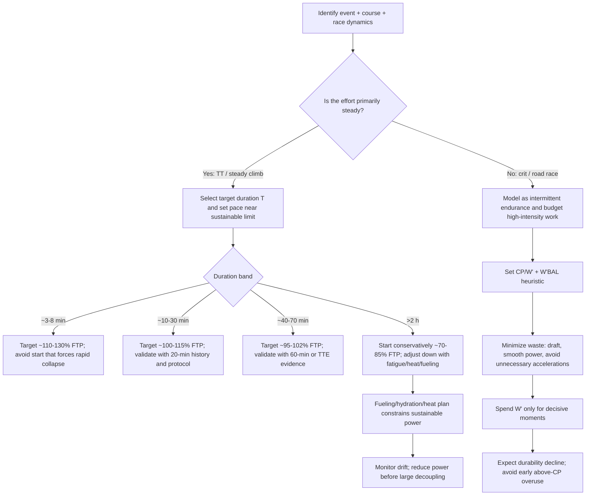
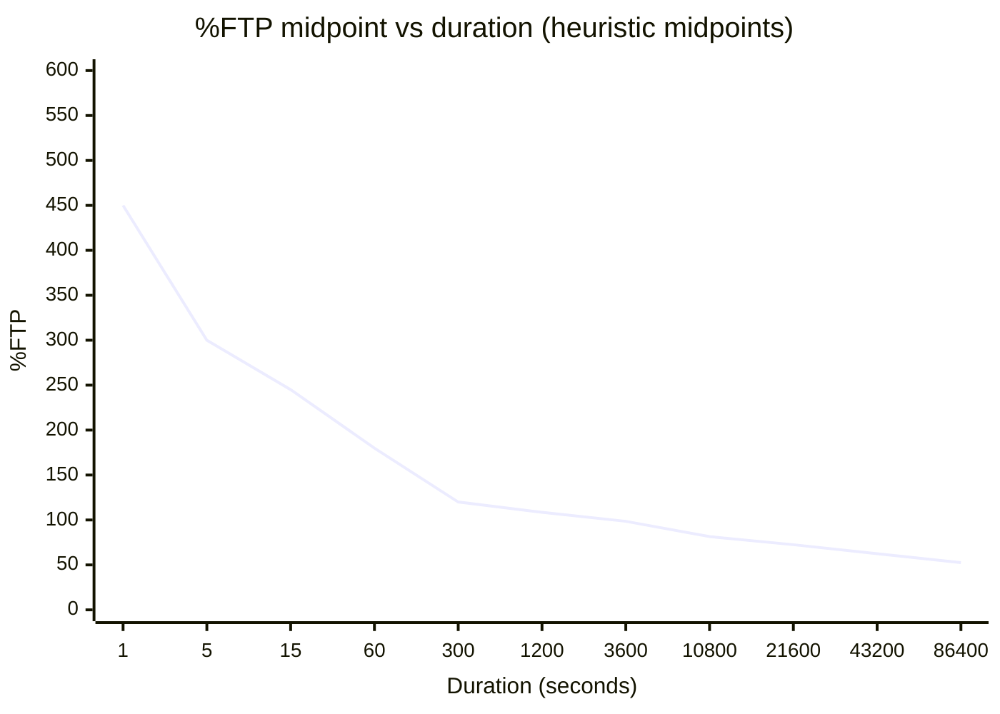
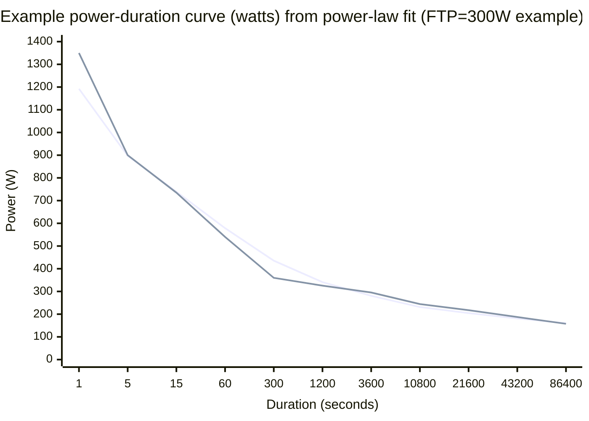
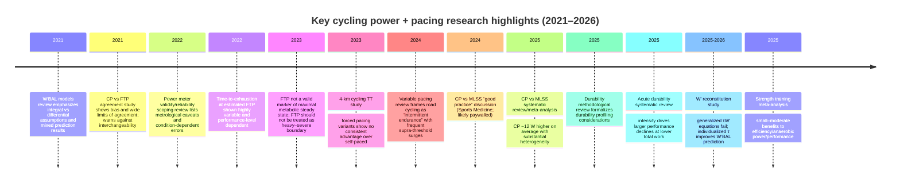

# Cycling Physiology, Power-Based Performance, and Pacing

## Assumptions and unspecified items

I am making these assumptions because athlete context is not provided; every table and rule below should be recalibrated once you specify these items.

**Assumed (because unspecified)**
- Athlete level: trained club cyclist (mixed phenotype; not a pure sprinter or pure time trialist).
- Testing environment: outdoor, mostly flat, steady conditions; no drafting (unless the event type implies it).
- Power meter: unspecified device and location (crank/spider/pedal/hub/trainer not specified).
- Bike/aerodynamics: unspecified (CdA, position, tires, drivetrain losses not specified).
- Environment: unspecified temperature, wind, altitude.
- Athlete mass: unspecified (so **W/kg cannot be computed directly**; I provide formulas and optional examples).

**How I would adapt outputs once you specify details**
- If you provide **mass (kg)**: I convert every watt target to **W/kg**, and I adjust climb vs flat pacing emphasis using course physics (gravity vs aero). citeturn13view4
- If you provide **event type and course profile** (grade distribution, wind): I shift pacing targets from “constant power” toward speed- or cost-of-time–optimal pacing where appropriate (especially on variable gradients). citeturn13view4
- If you provide **phenotype** (sprinter, TT, climber): I adjust the short-duration %FTP ranges and model parameters (W′, S/E in power-law) to reflect typical differences in sprint power and endurance decay. citeturn6view1
- If you provide **device + protocol**: I tighten the uncertainty bounds (e.g., reliability and test–retest error) and reduce model mismatch risk. citeturn6view5turn8view2

## Executive summary

Cycling performance is fundamentally a **power management** problem constrained by (i) the integrated aerobic system (VO₂max/MAP), (ii) the boundary between sustainable vs unsustainable metabolic states (often operationalized by MLSS or CP), (iii) finite high-intensity work capacity above that boundary (W′), and (iv) **durability**—how much those determinants degrade after prolonged or stochastic work. citeturn7view3turn5view2turn13view0turn6view3

Functional Threshold Power (FTP) is useful operationally, but the assumption that FTP is a physiological “threshold” (or that it reliably equals 60-min maximal steady power) is not consistently supported. Controlled physiology testing shows FTP does not behave as a clean marker separating heavy vs severe domains, and **time-to-exhaustion at FTP is highly variable** across athletes and performance levels. citeturn8view1turn9search0turn10view0turn8view2

For modeling performance across durations, the classic **Critical Power / W′ hyperbolic model** is still central for severe-domain efforts, but modern evidence shows its domain of validity is limited (often ~2 to ~15–25 minutes), and alternative models like the **power-law** can fit broader duration ranges and handle fatigue-induced curve “downshifts” more naturally. In practice, model choice should be driven by your use-case: short hard efforts (CP/W′), wide-range endurance prediction (power-law), intermittent racing (CP/W′ + W′ balance, validated individually). citeturn6view1turn5view3turn12view0

Event pacing differs sharply by format. **Time trials and steady climbs** reward controlling variability and selecting a pace profile consistent with your power–duration limits, while **criteriums and road races** are “variable pacing / intermittent endurance” events where repeated surges above CP matter and W′ budgeting becomes a practical framework. Ultra-endurance (6–24h) shifts the limiting factors toward fueling, thermoregulation, and durability. citeturn6view3turn3search5turn13view2turn5view2

Training and testing should reflect those constraints. Recent cyclist-specific meta-analysis indicates **polarized and non-polarized intensity distributions produce comparable improvements** in VO₂max and time-trial performance in trained cyclists; meanwhile, heavy strength training shows small-to-moderate positive effects on cycling efficiency, anaerobic power, and performance (with low certainty for “best implementation”). For pacing improvement, I treat pacing as a trainable skill: practice the exact pacing tasks you race (steady TT pacing, over-under surges, late-race efforts under fatigue). citeturn5view1turn5view0turn13view0

## Physiological foundations

### Energy systems and how they map to cycling power

Cycling power output is supported by overlapping ATP resynthesis pathways:

- **ATP–PCr (phosphagen)**: highest instantaneous power, short duration (seconds), limited by phosphocreatine availability and rapid depletion/repletion kinetics. In cycling sprint windows (10–60 s), substantial energy still comes from non-oxidative pathways early, but aerobic contribution ramps quickly. citeturn1search1turn1search17
- **Glycolytic (non-oxidative, “anaerobic glycolysis”)**: supports high power for tens of seconds to a few minutes, contributing to surges, accelerations, and severe-domain tolerance; lactate production reflects high glycolytic flux, not simply “lack of oxygen.” citeturn11view0turn11view1turn1search17
- **Oxidative (mitochondrial)**: dominates sustained efforts from minutes to hours, constrained by oxygen delivery/utilization and by substrate availability and fatigue processes. Even “middle-distance” cycling time trials (e.g., ~3 min) can have a major aerobic contribution, and aerobic dominance increases with duration. citeturn1search1turn1search17

A key applied takeaway: **perceived exertion is not a reliable indicator of “aerobic vs anaerobic.”** Many efforts that feel “anaerobic” are already heavily aerobic at the system level once duration exceeds ~1–3 minutes. citeturn1search1turn1search17

### VO₂max and MAP as ceilings on aerobic power

- **VO₂max / VO₂peak** is the maximal rate of oxygen uptake; in cycling it strongly constrains maximal aerobic energy turnover.
- **MAP (maximal aerobic power)** is the highest power reached in incremental tests or ramp protocols (definition varies by protocol) and is closely related to VO₂max and to high-intensity performance potential. citeturn10view3turn12view0turn5view1

In field/lab comparisons, FTP and MAP can correlate strongly, but that correlation does not mean FTP is a physiological threshold (it often behaves as a field performance index influenced by protocol and context). citeturn10view3turn8view1

### Lactate thresholds and MLSS

“Lactate threshold” is a family of operational definitions; MLSS is a specific steady-state construct:

- **MLSS** is typically defined as the highest constant workload at which blood lactate concentration remains stable (within a defined criterion) over a prolonged constant-load bout, representing (approximately) the upper boundary of a metabolic steady state. citeturn7view3turn0search37
- Different lactate threshold markers can disagree, and protocol and criteria strongly affect estimates, which matters if you use lactate to anchor training zones or validate FTP/CP. citeturn7view3turn0search37

### Modern lactate physiology

Modern physiology rejects “lactate = anaerobic waste”:

- Lactate is **continuously produced under aerobic conditions** and functions as both a transportable fuel and a signaling molecule. citeturn11view0turn11view2
- Whole-body “lactate shuttle” concepts extend beyond muscle: recent human tracer work supports lactate as a major vehicle for dietary carbohydrate carbon flow and challenges the simplistic “lactate implies hypoxia” narrative. citeturn11view1
- Lactate signaling and regulatory roles (e.g., receptors, lactate-mediated adaptations) help explain why lactate concentration is an informative **system state marker**, not merely a fatigue toxin. citeturn11view2turn11view0

### Explicit limitations of FTP as a physiological marker

I treat FTP as a **useful field-derived anchor** (especially for training prescription consistency), but not a clean physiological threshold, because:

1. **FTP does not reliably mark the heavy–severe boundary.** A controlled study testing exercise at FTP and FTP+15 W found that physiological responses (including lactate) indicate FTP should not be considered the threshold marker separating heavy vs severe intensity. In that study, time to task failure averaged ~33.7 min at FTP and ~22.0 min at FTP+15 W—far from “~60 minutes” in many athletes. citeturn8view1  
2. **Time-to-exhaustion at (estimated) FTP is highly variable and performance-level dependent.** In a large cross-sectional study using the Allen & Coggan 20-min field approach, median time-to-exhaustion at FTP was ~35 min (recreationally trained), 42 min, 47 min, and 51 min (professional level), reinforcing that “FTP = 60-min power” is often wrong without individual calibration. citeturn9search0  
3. **The 95% of 20-min power rule is not universal.** Updated modeling of 60-min power from 20-min power across performance levels suggests different coefficients: ~0.88 (recreationally trained) up to ~0.96 (professional). citeturn10view0  
4. **FTP and CP are correlated but not interchangeable.** In trained cyclists/triathletes, CP was modestly higher than FTP on average, with wide limits of agreement (mean bias ~7 W; LoA ~−19 to +33 W), supporting caution in swapping FTP and CP for pacing or prescription. citeturn8view2  
5. **Protocol details (warm-up and pacing) change FTP outcomes.** Different warm-up protocols altered 20-min TT performance and pacing strategy (e.g., conservative vs fast-start profiles), implying FTP estimates can be warm-up dependent unless standardized. citeturn10view2  
6. **Environment and specificity matter.** FTP derived outdoors (e.g., uphill) can exceed laboratory-derived markers (CP, lactate thresholds) in juniors, emphasizing that “FTP” is partly a performance expression sensitive to context, cooling, motivation, and terrain. citeturn10view3  

## Power–duration relationships and models

### Critical power and W′ (definitions, formulas, assumptions)

The classic **2-parameter CP model** describes a hyperbolic relationship between constant power and time to exhaustion in the severe domain.

**Definitions**
- **CP (critical power):** an asymptote representing the boundary between heavy and severe domains, often interpreted as the highest power at which physiological variables can stabilize (no progressive loss of metabolic homeostasis). citeturn7view3turn12view0  
- **W′ (W-prime):** a finite work capacity available above CP (units: joules), representing the “extra” work you can do above CP before exhaustion. citeturn12view0turn12view1  

**Core equations (constant-power severe-domain prediction)**

```text
Given:
  CP  = critical power (W)
  W'  = work capacity above CP (J)
  t   = time to exhaustion (s)
  P   = constant power (W), with P > CP

Time to exhaustion:
  t = W' / (P - CP)

Power for a target time:
  P(t) = CP + W' / t
```

These forms are widely used in applied cycling to estimate sustainable severe-domain efforts and to “budget” above-CP work. citeturn12view1turn12view0

**Key assumptions (often violated in real racing)**
- Power is constant and the athlete is “fresh.”
- CP and W′ are stable parameters (but fatigue, heat, glycogen depletion, and prior surges can shift effective performance). citeturn5view2turn6view1turn13view0
- The hyperbolic form is appropriate across the durations being modeled; however, evidence indicates the hyperbolic CP model is typically valid only across a limited duration window (often ~2 to ~15–25 min). citeturn6view1

### W′ balance variants (forms, parameters, limitations)

Because races are variable pacing, models estimate remaining W′ over time (**W′BAL**) by combining depletion (when P > CP) and reconstitution (when P < CP).

Skiba & colleagues’ review emphasizes two main formulations:

- **Integral form** (accumulates depletion and adds modeled reconstitution)
- **Differential form** (treats W′BAL as a state variable with depletion/recovery dynamics)

Both depend on assumptions about **how W′ reconstitutes below CP**, typically via an exponential recovery with a time constant τ that depends on recovery intensity. citeturn5view3turn12view0

**A general differential template (algorithm-friendly)**

```text
State:
  Wbal(t) in [0, W']  (J)

Dynamics:
  If P(t) > CP:
    dWbal/dt = -(P(t) - CP)
  Else:
    dWbal/dt = (W' - Wbal(t)) / τ(P(t), CP, ...)

Discrete time (Δt seconds):
  If P > CP:
    Wbal_next = Wbal - (P - CP) * Δt
  Else:
    Wbal_next = W' - (W' - Wbal) * exp(-Δt / τ)
```

This expresses the core idea without committing to a specific τ equation. citeturn5view3turn12view0

**Limitations that matter for pacing**
- The 2021 review highlights foundational issues: different formulations embed different assumptions, and real-world performance prediction has been mixed. citeturn5view3
- A 2025 open-access cycling study tested multiple τW′ equations and found **current generalized τ equations failed to predict exhaustion** in intermittent protocols; an individualized τ (calibrated from an exhaustion trial) improved W′BAL prediction. citeturn12view0  
**Practical implication:** if I want W′BAL to guide race decisions, I should either (i) calibrate τ individually, or (ii) treat W′BAL as a qualitative “surge budget meter,” not a deterministic predictor. citeturn12view0turn5view3

### Power-law and multi-parameter models

#### Power-law model (two-parameter)

Recent evidence supports power-law models as robust across wider duration ranges:

```text
Power-law:
  P(t) = S * t^(-E)

Where:
  S > 0 is a scale parameter (often interpreted as theoretical 1 s power in some treatments)
  0 < E < 1 is an endurance-decay exponent
```

Taking logs enables simple fitting:

```text
log(P) = log(S) - E * log(t)

Fit method:
  Linear regression on (log(t), log(P)) for maximal mean powers P over durations t
  (or robust regression / non-linear least squares for noisy field data)
```

A large-scale analysis and modeling paper argues the power-law model fits endurance data better across wide ranges and avoids hyperbolic-model distortions outside ~2–15–25 minutes; it also aligns naturally with the empirical observation that the power–duration curve shifts downward with fatigue. citeturn6view1

#### Multi-parameter models (practical overview)

Multi-parameter approaches are typically used to address shortcomings at very short or long durations, or to incorporate more physiology:

- **3-min all-out CP tests** and related variants attempt to simplify CP estimation by eliciting full W′ depletion within a single bout; these methods have assumptions and require careful validation. citeturn12view1
- Reviews of CP determination methods compare linear, hyperbolic, exponential, and model variants, and emphasize that accurate CP estimation depends on selecting trial durations within an appropriate window (often ~7–20 min trials) and that some models can systematically over/under-estimate CP and W′. citeturn12view1

### CP vs MLSS evidence and how I select a model in practice

**Empirical relationship**
- A 2025 systematic review/meta-analysis found CP is, on average, **~12.4 W higher than MLSS**, with substantial heterogeneity and wide agreement limits; interestingly, differences were significant when expressed in watts, but not clearly different when expressed as VO₂. citeturn7view3turn7view1
- A 2024 Sports Medicine paper (likely paywalled) argues that with strict determination criteria, CP and MLSS differences can be reconciled to only a few watts and provides “good practice” guidance. citeturn0search37turn0search9

**Practical model-selection guidance (algorithmic decision rules)**

```text
If goal = predict/pace maximal efforts ~2–15(25) min and you have good max trials:
  Use CP/W' (hyperbolic) for simplicity and interpretability.

If goal = predict across wide durations (minutes to many hours) or incorporate fatigue downshift:
  Use power-law (or piecewise models), validating against your own historical bests.

If goal = intermittent racing (crits/road races/MTB):
  Use CP/W' + W'BAL heuristics, but calibrate τ individually if you want quantitative prediction.

If goal = long events (3–24h) where durability and fueling dominate:
  Use durability-aware pacing (power targets that reduce as fatigue accumulates) + nutrition constraints;
  do not extrapolate CP/W' asymptote behavior into multi-hour targets.
```

The “hyperbolic window” limitation and fatigue-consistency argument come from the power-law vs CP analysis; W′BAL limitations and calibration needs come from the W′BAL review and the τ-equation failure results. citeturn6view1turn5view3turn12view0turn5view2turn13view0

## Practical sustainable power targets and worked examples

### Table A: Typical %FTP ranges by duration

Interpretation: these are **heuristic ranges** intended for pacing and planning when only FTP is available. The scientific literature does not provide a single universal %FTP-by-duration table; most “%FTP tables” are coaching heuristics, so I anchor the ranges to (i) known model validity constraints, (ii) evidence on FTP limitations and variability, (iii) energy system transition behavior, and (iv) durability evidence for long-duration decline. citeturn6view1turn8view1turn9search0turn5view2turn13view0turn1search1

| Duration | Typical sustainable power (%FTP range) | Notes (what this number *means*) | Evidence anchor |
|---|---:|---|---|
| 1 s | 300–600% | Neuromuscular + ATP–PCr dominated; highly phenotype-dependent; FTP is not a physiological reference here. | Short-duration energy contribution methods and rapid transitions justify high variability. citeturn1search1turn1search17 |
| 5 s | 200–400% | Sprint power; dependent on technique, cadence, and peak torque; not modeled well by CP asymptote logic. | Power–duration modeling debates show short durations distort hyperbolic fits; energy contribution remains mixed. citeturn6view1turn1search1 |
| 15 s | 170–320% | Transition window where glycolytic contribution becomes prominent; repeated-sprint ability matters. | Same rationale: short-duration model mismatch + mixed energy systems. citeturn6view1turn1search1 |
| 1 min | 140–220% | Very high intensity; aerobic contribution ramps fast, but W′/anaerobic work capacity strongly constraints maximal 1-min power. | Severe-domain framing + short-duration energy contribution measures. citeturn12view0turn1search1 |
| 5 min | 110–130% | Severe domain for many cyclists; often near VO₂max-power neighborhood; pacing errors are costly. | CP as heavy–severe boundary concept + severe-domain TT context. citeturn12view0turn6view1 |
| 20 min | 102–115% | Strongly affected by FTP test protocol (warm-up, pacing); 20-min power is not a stable proxy for 60-min power without level-specific conversion. | Warm-up dependence + 20→60 coefficient updates + FTP non-threshold evidence. citeturn10view2turn10view0turn8view1 |
| 1 h | 95–102% | “FTP zone,” but many athletes cannot hold estimated FTP for 60 min; calibrate using TTE and/or 60-min effort. | TTE-at-FTP variability + FTP not MMSS marker. citeturn9search0turn8view1 |
| 3 h | 75–88% | Endurance pacing; intensity distribution depends on durability and event variability; multi-hour targets should not be extrapolated from CP/W′ alone. | Durability methodology + intensity-driven fatigue effects; long-event constraints. citeturn5view2turn13view0turn13view2 |
| 6 h | 65–80% | Long endurance; durability and fueling dominate; expect “effective threshold” to decline after prior work, especially if above-CP work accumulates. | Durability review + evidence that high-intensity prior work causes larger declines at lower total work. citeturn5view2turn13view0 |
| 12 h | 55–70% | Ultra-endurance pacing; primarily moderate domain; manage fueling, hydration, and heat; sleep becomes relevant. | Ultra-cycling review on energy/fluid balance + durability framing. citeturn13view2turn5view2 |
| 24 h | 45–60% | Very long ultra pacing; performance constrained by durability, GI tolerance, environmental stress, and sleep/wake decisions. | Ultra-cycling review + durability concepts. citeturn13view2turn5view2 |

**Machine-readable midpoint table (for algorithms)**  
This is a *numeric-only* companion to Table A using midpoints of the above ranges (no citations inside code blocks).

```csv
duration_label,duration_s,ftp_percent_midpoint
1s,1,450
5s,5,300
15s,15,245
1min,60,180
5min,300,120
20min,1200,108.5
1h,3600,98.5
3h,10800,81.5
6h,21600,72.5
12h,43200,62.5
24h,86400,52.5
```

### Table B: Example absolute-power scaling for a sample athlete (FTP = 300 W)

**Given (example inputs)**
- FTP = 300 W (sample)
- CP = 280 W, W′ = 18,000 J (sample)
- Power-law parameters chosen to fit the midpoint curve (Table A) via log–log regression:
  - S ≈ 1192.15
  - E ≈ 0.17655

#### Formulas used (implementable)

```text
Percent-based target:
  P_pct(t) = FTP * (percent_midpoint / 100)

CP/W' severe-domain prediction (constant power):
  P_CP(t) = CP + W' / t

Power-law prediction:
  P_PL(t) = S * t^(-E)

W/kg conversion (mass not specified):
  W_per_kg = P / mass_kg
```

Model caveats that I enforce in implementation:
- CP/W′ predictions become nonsensical at very short durations (t→0) and should not be used for sprint windows; the hyperbolic model is also not intended for multi-hour durations in real humans. citeturn6view1turn5view2
- Power-law can represent broad ranges, but parameters must be fitted to *your* best efforts and should be re-fitted for fatigued-state curves if durability is a key limiter. citeturn6view1turn5view2turn13view0

#### Worked example calculations (selected)

```text
Example 1 (5 min target via %FTP midpoint):
  duration = 300 s
  percent_mid = 120%
  P_pct = 300 * 1.20 = 360 W

Example 2 (5 min via CP/W'):
  P_CP = 280 + 18000 / 300
       = 280 + 60
       = 340 W

Example 3 (5 min via power-law):
  P_PL = 1192.1516 * 300^(-0.1765457)
       ≈ 435.5 W
  (This is higher than the %FTP midpoint because the power-law fit is driven by
   the entire midpoint curve and does not “know” that 20–60 min may be FTP-limited.)

Example 4 (W/kg, mass unspecified):
  If mass_kg = m, then 360 W equals 360/m W/kg.
  If m = 75 kg (illustrative), then 360/75 = 4.80 W/kg.
```

#### Table B (computed outputs)

| Duration | %FTP midpoint | P_pct (W) | P_CP/W′ (W) | P_power-law (W) | Notes |
|---|---:|---:|---:|---:|---|
| 1 s | 450% | 1350.0 | 18280.0 | 1192.2 | CP/W′ is invalid for sprint scales (hyperbolic blow-up). citeturn6view1 |
| 5 s | 300% | 900.0 | 3880.0 | 897.3 | CP/W′ invalid here; use sprint testing/peak power. citeturn6view1turn12view1 |
| 15 s | 245% | 735.0 | 1480.0 | 739.1 | CP/W′ still not appropriate this short; power-law aligns better with curve shape. citeturn6view1 |
| 1 min | 180% | 540.0 | 580.0 | 578.6 | Here CP/W′ begins to be interpretable (still aggressive). citeturn12view1turn6view1 |
| 5 min | 120% | 360.0 | 340.0 | 435.5 | Severe-domain estimation: CP/W′ gives conservative constant-power cap; validate with real 5-min best. citeturn12view1turn6view1 |
| 20 min | 108.5% | 325.5 | 295.0 | 341.0 | CP/W′ may underpredict if effort is near/under CP boundary; power-law may overpredict depending on fit. citeturn6view1turn7view3 |
| 1 h | 98.5% | 295.5 | 285.0 | 280.9 | CP/W′ tends toward CP; 1 h should be validated with TTE/60-min test due to FTP variability. citeturn9search0turn8view1turn6view1 |
| 3 h | 81.5% | 244.5 | 281.7 | 231.3 | CP/W′ not intended for multi-hour pacing; durability drives down sustainable power. citeturn5view2turn6view1turn13view0 |
| 6 h | 72.5% | 217.5 | 280.8 | 204.7 | Use durability + fueling constraints; avoid CP/W′ extrapolation. citeturn5view2turn13view2 |
| 12 h | 62.5% | 187.5 | 280.4 | 181.1 | Ultra pacing depends on long-term fatigue management and energy/fluid balance. citeturn13view2turn5view2 |
| 24 h | 52.5% | 157.5 | 280.2 | 160.3 | Power-law and %FTP midpoints converge here by construction; real-world constraints can push lower. citeturn13view2turn5view2 |

**Machine-readable Table B (numeric-only)**

```csv
duration_label,duration_s,pct_mid,P_pct_W,P_CP_W,P_powerlaw_W
1s,1,450,1350.0,18280.0,1192.2
5s,5,300,900.0,3880.0,897.3
15s,15,245,735.0,1480.0,739.1
1min,60,180,540.0,580.0,578.6
5min,300,120,360.0,340.0,435.5
20min,1200,108.5,325.5,295.0,341.0
1h,3600,98.5,295.5,285.0,280.9
3h,10800,81.5,244.5,281.7,231.3
6h,21600,72.5,217.5,280.8,204.7
12h,43200,62.5,187.5,280.4,181.1
24h,86400,52.5,157.5,280.2,160.3
```

### W/kg considerations when mass is unspecified

Because mass is unspecified, I recommend expressing climbing-related targets as:

```text
W/kg = watts / mass_kg
```

But I do **not** treat W/kg as a universal performance predictor, because aerodynamic drag, terrain, wind, and pacing strategy determine how watts convert to speed, and the “best” scaling exponent can be course-specific (not always 1.0). citeturn13view4

## Pacing rules by event type

### Pacing decision flowchart (algorithm-ready)



This logic is grounded in (i) variable pacing “intermittent endurance” characteristics, (ii) W′BAL limitations and calibration needs, (iii) TT pacing evidence favoring self-selected pacing over imposed strategies on average, and (iv) durability evidence that intensity (not only kJ) drives decline. citeturn6view3turn5view3turn13view3turn13view0turn6view4

### Criterium (crits)

**Race physiology:** repeated accelerations + tactical positioning; highly variable power demands. citeturn6view3turn3search5

**Rules of thumb**
- I treat a crit as an **intermittent endurance** event: I win/lose on how I manage repeated surges, not on steady FTP alone. citeturn6view3
- I avoid “burning matches” early: excessive time above CP early increases the probability of late-race collapse (W′ budget depletion + durability decay). citeturn5view3turn13view0
- I draft aggressively to reduce baseline aerobic cost and preserve W′ for decisive moves (positioning can matter as much as physiology in crit contexts). citeturn3search5turn13view4

### Road race

**Race physiology:** variable pacing from terrain + tactics; repeated supra-threshold surges can dominate fatigue and outcome. citeturn6view3turn13view0

**Rules of thumb**
- I keep my “cruise” intensity anchored below the heavy–severe boundary when possible, so I can respond to moves without exhausting W′ prematurely. citeturn7view3turn5view3
- I use W′BAL as a heuristic: if I repeatedly surge above CP, I assume my risk of failing on the next decisive surge increases unless I get meaningful recovery below CP. citeturn5view3turn12view0
- I care about durability: high-intensity prior work can cause ~10–20% power declines with surprisingly low accumulated work (when expressed per kg), so I avoid stacking unnecessary high-intensity surges early. citeturn13view0

### Time trial

**Evidence base:** a 4-km cycling TT study compared self-paced vs two forced pacing variants (all-out start then holding mean or mean+5% for the first km) and concluded forced pacing did not add performance benefit on average; large reviews across endurance sports find no consistent advantage of imposed pacing vs self-selected pacing, with slow-start sometimes harmful if too long. citeturn6view4turn13view3

**Rules of thumb by duration**
- **Short TT (~3–8 min):** I target ~110–130% FTP, and I allow a *controlled* fast start but avoid an over-aggressive start that collapses power later; I test whether forced pacing helps me individually rather than assuming it does. citeturn6view4turn13view3
- **20 min:** I treat 20-min power as highly protocol dependent (warm-up matters), and I don’t assume “95% of 20-min = 60-min.” I calibrate my 20-min TT pacing using my own history and/or level-adjusted conversion factors. citeturn10view2turn10view0
- **40–60 min:** I treat this as the zone where FTP is useful, but I validate using time-to-exhaustion evidence because many riders cannot sustain estimated FTP for 60 minutes. citeturn9search0turn8view1

### Hill climb

I separate climbs into **constant-grade** vs **variable-grade**:

- On constant grade, constant power pacing is closer to optimal.
- On variable grade, optimal pacing can be course-specific; simple W/kg rules can mislead, and physics-based scaling can be more accurate for performance prediction. citeturn13view4turn9academia31

**Rules of thumb**
- If it’s a **single sustained climb** of duration T, I pace it like a steady TT of duration T (use the Table A band for that duration, then adjust by my historical climb performance). citeturn6view1turn13view4
- I avoid unnecessary surges on steep ramps unless the time gain is tactically decisive, because above-CP surges spend W′ that I might need later, and high-intensity prior work drives durability decline disproportionately. citeturn5view3turn13view0

### Ultra-endurance (6–24 h)

**Constraint shift:** multi-hour cycling performance increasingly depends on durability, fluid/energy balance, and cumulative physiological stress. citeturn13view2turn5view2

**Rules of thumb**
- I start conservatively: typical steady targets drift toward ~65–80% FTP for ~6 h and ~45–60% FTP for ~24 h, with wide individual variability. citeturn13view2turn5view2
- I do not extrapolate CP/W′ into ultra pacing; instead I plan for downshifts in sustainable power with fatigue and manage intensity to protect durability. citeturn5view2turn6view1

### Stage races

Stage racing is “durability across days.” I treat performance as state-dependent: your power–duration curve is not constant day-to-day.

**Rules of thumb**
- I assume “effective” sustainable power declines after high-intensity accumulated work, and I manage which stages I spend my above-CP matches, because intensity is a key driver of acute durability loss. citeturn13view0turn5view2
- I evaluate late-stage capability (e.g., 20-min power after substantial prior work) because distinguishing elite performance often depends on maintaining power under fatigue. citeturn13view1turn5view2

## Training, testing, and reliability

### FTP estimation protocols (20-min, 60-min, ramp/graded)

**20-min FTP (Allen & Coggan style)**
- Common computation: FTP ≈ 0.95 × 20-min maximal mean power (MMP20). This is operationally convenient but not universally valid for estimating 60-min power. citeturn10view0turn9search0
- Protocol matters: warm-up structure changes pacing strategy and 20-min TT output, changing the resulting FTP estimate. citeturn10view2

**60-min test**
- The best direct estimate of “60-min power” is still a well-paced ~60-min maximal effort in conditions matching your target events, acknowledging environmental and tactical confounders. The need for this calibration is highlighted by large between-athlete variability in TTE at estimated FTP. citeturn9search0turn8view1

**Ramp / graded exercise tests**
- Graded exercise tests (GxT) measure physiological responses (VO₂, HR, lactate profiles) and can estimate MAP/VO₂max; one open-access study derived an equation to predict FTP from GxT in highly trained individuals, reflecting continued interest in linking lab-derived metrics to field FTP. citeturn10view1
- I treat “ramp-derived FTP” conversions used by commercial platforms as **empirical approximations** unless validated on my own 40–70 min performance, because FTP itself is not a stable physiological threshold. citeturn8view1turn9search0turn10view1

### CP/W′ estimation protocols (multiple trials, 3-min all-out, model choice)

A 2022 review of CP determination methods emphasizes:
- Accurate estimations typically require trial durations in an appropriate window (often ~7–20 min) and careful model choice; some models systematically overestimate CP or underestimate W′. citeturn12view1
- Field CP estimation can be accurate under good protocols; for example, predicting a 20-min TT using CP and W′ via P = CP + W′/1200 is explicitly described and evaluated in CP-method studies. citeturn12view1turn8view2

### Reliability, device error, and common testing mistakes

**Power meter validity and reliability**
- A systematic scoping review highlights that power meter validity depends on many metrological properties (accuracy, repeatability, robustness) and on conditions like cadence, torque, temperature, and vibration; incomplete testing across conditions can cause misinterpretation. citeturn6view5

**Protocol standardization is not optional**
- Warm-up and pacing differences can change FTP outcomes. citeturn10view2
- Field vs lab context can change measured FTP relative to lab markers (cooling, terrain specificity, motivation). citeturn10view3

**Expected “measurement-scale” uncertainty**
- In trained athletes, CP vs FTP agreement shows typical error on the order of ~13 W with CV ~5–6% in one open-access study, illustrating that small changes (e.g., 5 W) are often below noise unless tightly standardized. citeturn8view2

### Training interventions to improve FTP/CP/durability and pacing skill

**Training intensity distribution**
- In trained cyclists, a 2025 systematic review/meta-analysis found polarized and non-polarized interventions produced **similar improvements** in VO₂max and time-trial performance, suggesting I should prioritize executing a sustainable distribution consistently rather than chasing a single “best” model. citeturn5view1

**Heavy strength training**
- A 2025 open-access systematic review/meta-analysis found heavy strength training (≥80% 1RM) improved cycling efficiency (ES ≈ 0.353), anaerobic power (ES ≈ 0.560), and cycling performance (ES ≈ 0.463), with no significant effect on VO₂max, pVO₂max, MMSS, or anaerobic capacity; certainty was low, so implementation details matter. citeturn5view0turn9search14

**Durability-focused training**
- Durability is defined as resilience to deterioration of physiological variables and performance during or after prolonged exercise; methodological work emphasizes controlling intensity, duration, nutrition, and environment when profiling durability. citeturn5view2
- A 2025 systematic review on acute durability indicates intensity is pivotal: **10–20% power declines** were observed after relatively low amounts of prior high-intensity work (2.5–15 kJ/kg), and total work (kJ) alone is an incomplete fatigue metric. citeturn13view0

**Pacing-skill training drills (practical, implementable)**
- **Steady TT drill:** 2–4 × 20 min at a target band with strict power cap and a negative-split attempt; repeat across weeks and compare variability and finish strength. (20-min outcomes are protocol-dependent, so standardize warm-up.) citeturn10view2turn10view0
- **Severe-domain pacing drill:** multiple 3–8 min efforts with controlled starts; test whether a controlled fast start improves or harms you (individual response matters). citeturn6view4turn13view3
- **Over-under / race simulation:** alternate blocks below and above CP to train W′ spending/reconstitution and decision-making; treat W′BAL as a guide and calibrate τ individually if you want quantitative prediction. citeturn5view3turn12view0

## Limitations, uncertainties, and open questions

### Key limitations and uncertainty sources

- **FTP is not a clean physiological marker** of maximal metabolic steady state; TTE at FTP is often far below 60 minutes and varies widely across athletes and protocols. citeturn8view1turn9search0turn10view2
- **CP vs MLSS agreement is imperfect**: CP averages ~12 W higher than MLSS with large heterogeneity; different methods may reconcile differences, but interchangeability is not guaranteed without strict criteria. citeturn7view3turn0search37
- **Model mismatch**: hyperbolic CP is typically valid over a limited duration band (~2–15–25 min), while power-law can cover broader ranges; neither is “true” across all conditions without validation. citeturn6view1
- **W′BAL depends on assumptions** about recovery kinetics; generalized τ equations can fail to predict exhaustion, strengthening the case for individual calibration. citeturn5view3turn12view0
- **Durability is under-standardized** as a measurement construct; intensity, nutrition, temperature, and protocol design strongly affect observed “fatigue resistance.” citeturn5view2turn13view0turn6view5
- **Context dominates watts-to-speed conversion**: wind, gradient, drag, and equipment mass affect performance prediction, and optimal power-to-mass scaling can be course-specific. citeturn13view4

### Open research questions that constrain applied precision

- How should I best model **state-dependent power–duration curves** (fresh vs fatigued) for cycling, and what are the most reliable field protocols to estimate that downshift? citeturn6view1turn5view2turn13view0
- Can W′BAL be made reliably predictive in the field without extensive individual calibration, given current τ-equation failures in intermittent exhaustion tasks? citeturn12view0turn5view3
- What training interventions most efficiently improve **durability** (as distinct from fresh FTP/CP), and how does intensity distribution interact with durability outcomes? citeturn13view0turn5view1turn5view2

## Latest key sources, visuals, and implementation notes

### Visuals: power–duration and %FTP vs duration

**%FTP midpoint vs duration (Table A midpoints)**



This chart is a visualization of the midpoint heuristic table and should be replaced by your fitted curve from your own MMP data; the need to validate model structure across durations comes from the power-law vs CP analysis. citeturn6view1

**Power–duration curve example (watts) for FTP=300W, power-law fit (S≈1192, E≈0.1765)**



This dual-curve plot highlights that “%FTP heuristics” and “global power-law fits” can diverge at some durations; choosing between them is a model selection problem, not a single-truth problem. citeturn6view1turn8view1turn5view2

### Mermaid timeline of key studies (2021–2026)



Timeline entries are supported by the cited peer-reviewed sources listed below. citeturn5view3turn8view2turn6view5turn9search0turn8view1turn6view4turn6view3turn0search37turn7view3turn5view2turn13view0turn12view0turn5view0

### Implementation notes: generating higher-quality plots (no external files required)

If I want publication-quality plots:
1. Copy the CSV tables above into a dataframe.
2. Plot with **log-scaled x-axis** (duration) to visualize the curve shape more realistically.
3. Fit power-law parameters (S, E) by log–log regression; optionally fit separate segments (e.g., sprint, severe, long endurance) if I want a piecewise model. citeturn6view1turn12view1

### Prioritized reference list (open access preferred; paywalled marked)

1. **Modelling human endurance: power laws vs critical power** (2023; open access). citeturn6view1  
2. **Analysis of the factors influencing the proximity and agreement between critical power and maximal lactate steady state: a systematic review and meta-analyses** (2025; open access). citeturn7view3  
3. **Functional threshold power is not a valid marker of the maximal metabolic steady state** (2023; paywalled journal, open accepted manuscript/PubMed). citeturn8view1turn6view2  
4. **Time to exhaustion at estimated FTP in road cyclists of different performance levels** (2022; abstract accessible). citeturn9search0turn9search1  
5. **An Update of the Allen & Coggan Equation to Predict 60-Min Power Output** (2023; abstract accessible). citeturn10view0  
6. **Relationship Between the Critical Power Test and a 20-min FTP Test in Cycling** (2021; open access). citeturn8view2  
7. **The W′ Balance Model: Mathematical and Methodological Considerations** (2021; review, abstract accessible). citeturn5view3  
8. **W′ reconstitution modelling during intermittent exercise performed to task failure** (2025; open access). citeturn12view0  
9. **Durability as an index of endurance exercise performance: Methodological considerations** (2025; open access). citeturn5view2  
10. **Is intensity the most important factor… that affects cyclists’ acute durability? A systematic review** (2025; open access). citeturn13view0  
11. **The Characteristics of Endurance Events with a Variable Pacing Profile—Time to Embrace “Intermittent Endurance Events”?** (2024; open access). citeturn6view3  
12. **Effect of different pacing strategies on 4-km cycling time trial performance** (2023; open access). citeturn6view4  
13. **Comparative Effects of Pacing Strategies on Endurance Performance: systematic review + network meta-analysis** (2024; abstract accessible; paywalled journal). citeturn13view3  
14. **Caveats and Recommendations to Assess the Validity and Reliability of Cycling Power Meters: systematic scoping review** (2022; open access). citeturn6view5  
15. **Determination of Critical Power Using Different Possible Approaches: A Review** (2022; open access). citeturn12view1  
16. **Heavy strength training effects on physiological determinants of endurance cyclist performance: systematic review + meta-analysis** (2025; open access). citeturn5view0turn9search14  
17. **The effect of training distribution, duration, and volume on VO₂max and performance in trained cyclists** (2025; open access). citeturn5view1  
18. **Modern Perspective of Lactate Metabolism** (2024; open access). citeturn11view0  
19. **Enteric and systemic postprandial lactate shuttle phases… in humans** (2024; Nature Metabolism; paywalled site but abstract visible). citeturn11view1  
20. **Lactate: a multifunctional signaling molecule** (2021; open access). citeturn11view2  
21. **Functional Threshold Power Field Test Exceeds Laboratory Performance in Junior Road Cyclists** (2023; open access). citeturn10view3  
22. **Functional Threshold Power Estimated from a 20-minute TT is Warm-up-dependent** (2022; paywalled journal, abstract accessible). citeturn10view2  
23. **Optimal body mass normalization of power output for accurate performance prediction over complex TT courses** (2025; open access). citeturn13view4  
24. **Ultra-Cycling—Past, Present, Future: A narrative review** (2024; open access). citeturn13view2  
25. **Critical Power and MLSS in Cycling: “Watts” the Difference?** (2024; Sports Medicine; likely paywalled). citeturn0search37